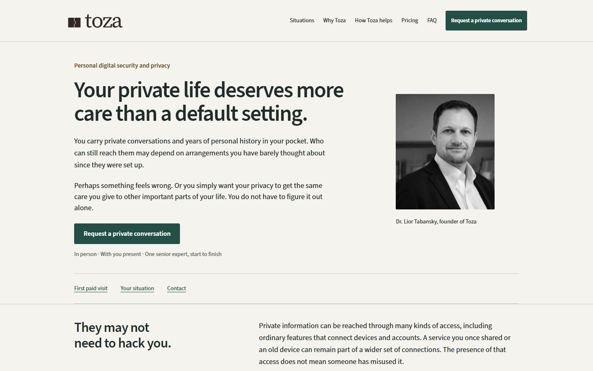
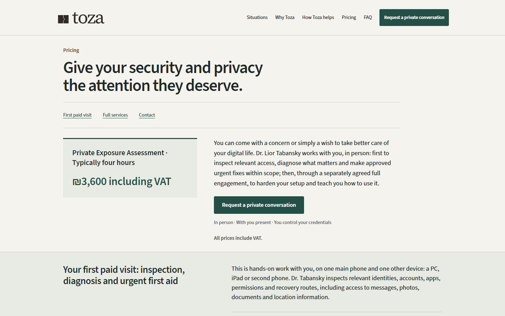

# Home / Pricing narrative presentation

Status: prepared for review only. Do not merge or deploy without a later owner instruction.
Base: `ed8d06aba134132b9832e46df2771fb0aaecbdba` (`main`, deployed direction A).
Branch: `codex/toza-home-pricing-narrative`.

The approved preview gives personal risk and the benefit of full hardening earlier prominence. Pricing exposes the first paid visit's fee, keeps six decision rows visible, and places the complete credit conditions beside the comparison. Contact warnings and both contact channels stay together. Accepted wording, prices, service boundaries, metadata and links remain unchanged.

## Implementation and scope

- `scripts/home-pricing-narrative.cjs` moves complete accepted blocks after the existing presentation adapter, before Nunjucks renders the contact include. `npm run sync:copy` reproduces both generated templates.
- Only Home and Pricing load the additional stylesheet and route-specific script. Existing routes retain their current assets. The new script differs from the shared script only in preventing the skip link from opening an unrelated disclosure; a regression test enforces that relationship.
- Two approved heading-level changes are explicitly allowed by the exact-copy verifier: Home's Assessment explanation and Pricing's nested credit heading become H3. All other block kinds, words, counts and table associations stay strict.
- No changes to accepted Markdown, acceptance fingerprints, dependencies, workflows, analytics, contact destinations, or protected Assessment.

## Completed local gates

- Clean dependency install; `npm run verify:all` passed: source fingerprints, reproducible templates, all 11 English pages, metadata, table associations, protected Assessment order, retained Hebrew legal documents, withdrawn marketing languages, links/anchors and CI contract.
- `npm run test:rtl-visual`: **50/50 passed** using pinned Playwright 1.52.0 / Chromium 136. Desktop and mobile projects plus 320/390/640/768/1024/1440-width checks; keyboard menu/skip, disclosures, deep links, print restoration, reduced motion, responsive comparisons and 390x667 contact visibility.
- Integrated Home/Pricing DOM (elements, attributes and text) and CSS match the approved local preview. The other nine English HTML files are byte-identical to the clean baseline build.
- Desktop/mobile screenshots from this integrated build were visually inspected, including the benefit, comparison and credit sections. Primary reviewer performed browser and visual checks.
- Independent technical review: no actionable findings. Independent adversarial review against v3 authority: no concrete findings. Both reviewed source/generated output; neither claimed an independent live-browser session.
- Review skill applied with its official upstream checklist because the local supporting checklist was absent: https://raw.githubusercontent.com/garrytan/gstack/main/review/checklist.md . Codex CLI was unavailable; fresh agent adversarial review supplied the independent source gate. Code Review plugin is used for CI diagnostics, not represented as a source-code reviewer.

These are engineering and presentation checks, not evidence of lead conversion or complete WCAG certification. Physical phones, Safari and assistive-technology testing were not performed.

## Release holds and later sequence

1. Keep this PR unmerged. Production and hosted previews have not been changed. Existing preview workflow is restricted to `codex/toza-clear-practice`; this branch cannot trigger its deploy job. Production deploy runs only after a push to `main`.
2. Build dependency risk remains inherited from `main`: audit reports 18 affected nodes (2 critical, 14 high, 2 moderate). This is **not a clean dependency gate**. Separate PR #53 contains the reviewed maintenance changes and records its residual upstream advisories; this PR does not absorb them. Recommended release order: review/land #53 first when authorized, then update this branch and rerun its complete gates on the resulting toolchain. Do not assume #53 makes every advisory disappear.
3. Require passing GitHub checks at the final head, a reviewed diff, unchanged acceptance fingerprints and owner release authorization. GitHub browser artifacts provide CI-platform evidence; local tests used Node 24 on Windows and CI uses the unchanged Node 20/Linux setup until maintenance lands.
4. Only after authorization, merge through GitHub and let the existing main-only deployment workflow run. Verify live English routes, withdrawn-language responses, contact links, canonical/indexing headers and the current commit; do not send messages as part of testing.
5. Roll back by reverting this presentation PR through a new reviewed PR. Preserve any independently merged dependency maintenance. Never force-reset `main`.

## Integrated desktop and mobile captures

| Home desktop | Home mobile |
| --- | --- |
|  |  |

| Pricing desktop | Pricing mobile |
| --- | --- |
|  |  |

Full-page screenshots are also produced by the browser suite and uploaded as GitHub Actions artifacts. No hosted preview is requested by this PR.
